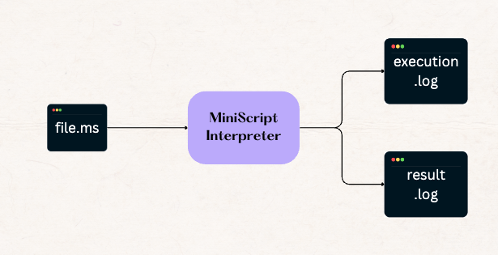
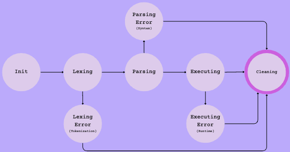

# Miniscript Interpreter

## Overview
A tree-walk interpreter for [Miniscript](https://miniscript.org/) supporting:
- Data Types: 
  - Numbers: Standard Math, Mod, Power, Logical Operators, Comparison 
  - String: Concatenation, Subtraction, Replication, Division
  - Bool
  - Null
- Control Flow:
  - If: else if, else and nested
  - While: with break and continue
- Function: recursion and mutual recursion

## Architecture
- We support to main mode of execution: REPL or Miniscript `.ms` file. We will output `execution.log` detailing or interpreting steps with any errors flagged and `result.log` for the final execution result. 


## Finite State Machine (FSM)
- Our interpreter follows a simple FSM consisting of:
  - `Init`: intialize value and context
  - `Lexing`: tokenisation
  - `Parsing`: syntax analysis to abstract syntax tree (AST)
  - `Executing`: execute Miniscript code based on AST
  - `Lexing Error`: handle Tokenisation Error
  - `Parsing Error`: handle Syntax Error
  - `Executing Error`: handle Runtime Error
  - `Cleaning`: free memory used
    


## Usage
- Build the interpreter
```shell
cd src
make clean && make
```
- Run REPL:
```shell
./miniscript
```
- Run file:
```shell
./miniscript path/to/your/file.ms
```
- You can find our Miniscript test files in the [test](test) folders.

## References:
- [Crafting Interpreters](https://craftinginterpreters.com/)
- [Python3 CFG](https://docs.python.org/3/reference/grammar.html)
